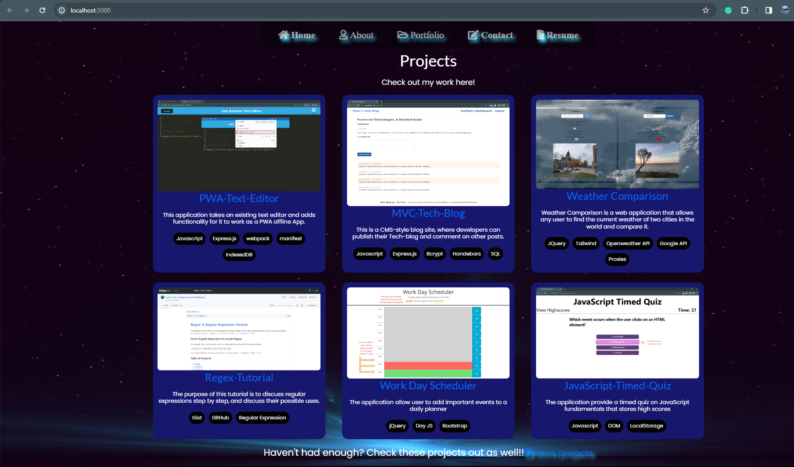
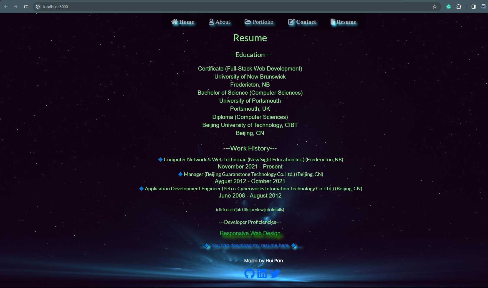

# Portfolio React + Vite

  [](https://choosealicense.com/licenses/mit//)
        
  ## Description
     The project is a single-page application developed with React. This platform serves as a consolidated showcase of my various projects, demonstrating my proficiencies. Through a user-friendly interface, visitors can explore a diverse collection of applications, gaining insights into my capabilities and works.
  
  ## Table of Contents
  - [Usage](#usage)
  - [Link](#link)
  - [Technologies Used](#Technologies-Used)
  - [License](#license)
  
  ## Usage
  When you go to the site, you will first landing to my "Home" page. At the top, you can navigate to "About", "Portfolio", "Contact", or "Resume" pages. 

  

  On the "About" page, I made a short introduction of myself to help the visitor to know who is about me. 

  

  On my "Portfolio" page, there are six projects listed. You can see the project description and technologies used. When you hover to the image, A ```Live Demo``` button will navigate you to the application deployed page, and a ```Source Code``` button will redirect you to the GitHub source code. 

  

  On the "Contact" page, there's a contact form with three fields all required. Once they're filled out, when you click submit I will get an email sent to me with your message. 

  

  On my "Resume" page, there are two sections of brief summary about my education and work history. when you click each job title, started with 🔷, a more detailed description will show off. By the end of the page, you can also download a PDF form of my resume.

  

  On the footer, my social media contact also listed, as well as logos for Github, Linkedin, and Twitter. Click on the logo of a social network, and another tab with my profile from that network will open. 

  ## Link
  You can visit my porfolio at https://

  ## Technologies-Used
    <p><a href="https://vitejs.dev/">Vite</a></p>
    <p><a href="https://github.com/vitejs/vite">Vite (Plugin React)</a></p>    
    <p><a href="https://reactjs.org/">React</a></p>
    <p><a href="https://reactjs.org/">React DOM</a></p>
    <p><a href="https://react-icons.github.io/react-icons/">React Icons</a></p>
    <p><a href="https://www.npmjs.com/package/react-simple-typewriter">React Simple Typewriter</a></p>
    <p><a href="https://nodejs.org/">Node.js</a></p>
    <p><a href="https://www.npmjs.com/">NPM</a></p>
    <p><a href="https://fontawesome.com/">Font Awesome</a></p>
    <p><a href="https://fontawesome.com/">Font Awesome (React)</a></p>
    <p><a href="https://www.emailjs.com/">EmailJS</a></p>
    <p><a href="https://www.emailjs.com/">EmailJS (Com)</a></p>
    <p><a href="https://semantic-ui.com/">Semantic UI CSS</a></p>
    <p><a href="https://react.semantic-ui.com/">Semantic UI React</a></p>
    <p><a href="https://sweetalert2.github.io/">SweetAlert2</a></p>
    <p><a href="https://eslint.org/">ESLint</a></p>
    <p><a href="https://eslint.org/">ESLint (Plugin React)</a></p>
    <p><a href="https://www.npmjs.com/package/eslint-plugin-react-hooks">ESLint (Plugin React Hooks)</a></p>
    <p><a href="https://www.npmjs.com/package/eslint-plugin-react-refresh">ESLint (Plugin React Refresh)</a></p>
    <p><a href="https://www.netlify.com/">Netlify</a></p>
  
  ## License
  This project is covered under the MIT license. To learn more, click the badge at the top.

  ## Questions
  If you have any questions, reach out to me at https://github.com/HuiPan-Peter, or shoot me an email at guaranstone@gmail.com.
